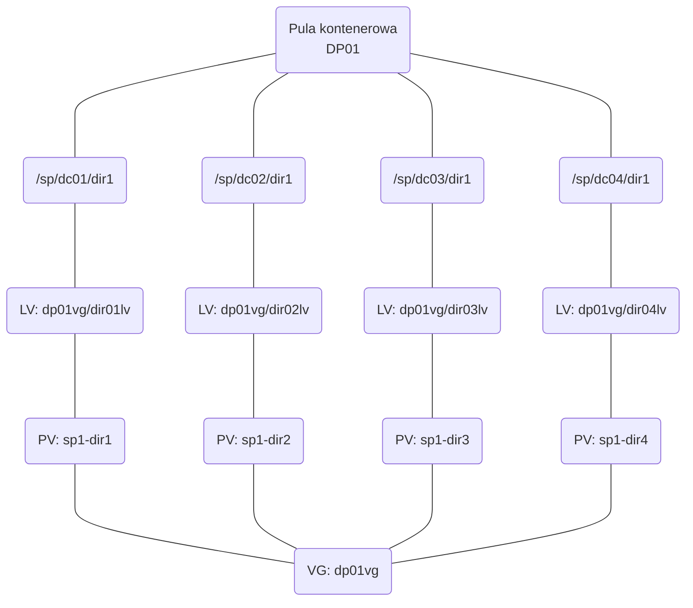

# Pule kontenerowe

Jak z nimi żyć? 

Pojawiły się wraz z 7.1.3, czyli są już na rynku od 2017 roku, a nadal dostarczają sporo radośći. Ty jest zbiór moich doświaczeń z pulami kontenerowymi. 

## Zasady użycia

- [x] Pule konetenerowe nie nadają się do składowania danych zaszyfrowanych przezd zapisem (np szyfrowanych RMANem)
- [x] Dane wcześniej skompresowane też nie bardzo nadają się do składowania w kontenerach, choć dają się _deduplikować_. 
- [x] Migracja pomiędzy pulami zwykłymi i kontenerowymi jest [nietrywialna](../adm/dcp.md#migracja-i-kopiowanie-pomiedzy-pulami).
- [x] Disaster recovery lepiej oprzeć na replikacji
- [x] [Utrzymanie](../adm/dcp.md#utrzymanie) puli kontnerowej oznacza replkację, backup i regularne [audyty](../adm/dcp.md#audyt).

Najważniejszą zasadą, opisywaną także w Blueprintach, jest zasada 1:1. czyli jeden dysk = 1 LV = 1 filesystem= 1 katalog. Striping jest ro biony na przez Protecta.



## Tworzenie puli kontenerowej


1. Załóż filesystemy według powyższego schematu.

    === ":simple-linux: Linux"

        Założenia:

        - Moje dyski/urządzenia mpath nazywają się `cinek-sp1-dir*`. 
        - grupa będzie nazywać się `dirpoolvg`.
        - Całość będzie zmontowana do `/sp/dp01/dir*`.


        Procedura:


        1. Wyciagnij listę dysków. Zrobiłeś je według [tego](../../LNX/san/MPIO_and_SAN.md) przepisu?

            ```bash
            sudo multipath -ll | grep cinek-sp1-dir | cut -f 1 -d " "
            ```

            Na przykład tak:

            ```bash title="Przykład"
            sudo multipath -ll | grep cinek-sp1-dir | cut -f 1 -d " "
            cinek-sp1-dir1
            cinek-sp1-dir2
            cinek-sp1-dir3
            cinek-sp1-dir4
            ```
        
        1. Założ na nich PV.
        1. Dodaj do grupy `dirpoolvg`
        1. Na każdym z PV załóź LV tak, żeby zeżarł dokładnie jednen cały dysk:

            ```bash
            lvcreate -n dir01lv -l 100%free dirpoolvg /dev/mapper/cinek-sp1-dir1
            ```
        
            Powtórz ten krok dla wszyskich PV.

        1. Załóź filesystem na utworzonych woluminach logicznych. Np. XFS.
        1. Dodaj montowanie do `/etc/fstab`:

            ```bash
            cat >> /etc/fstab << EOF
            /dev/mapper/dirpoolvg-dir01lv				/sp/dp01/dir1	xfs	defaults	0 0
            /dev/mapper/dirpoolvg-dir02lv				/sp/dp01/dir2	xfs	defaults	0 0
            /dev/mapper/dirpoolvg-dir03lv				/sp/dp01/dir3	xfs	defaults	0 0
            /dev/mapper/dirpoolvg-dir04lv				/sp/dp01/dir4	xfs	defaults	0 0
            EOF
            ```

            !!! Warning "Uwaga na klaster"

                Oczywiście jeśli TSM będzie w klastrze, to do opcji trzeba dodać `noauto` :shrug:.

        1. Walnij `systemd` w łeb i zmontuj filesytemy:

            ```bash
            sudo systemctl daemon-reload
            sudo mount -a 
            ```


    === ":AIX-old: AIX"

        !!! Bug

            Wygrzebać notatki z ostatnigo wdrożenia.

    === ":material-microsoft-windows-classic: WinDOS"

        :simple-redragon: Tu żyją smoki. Nie idź tą drogą.


1. Załóż putą pulę: 
    
    ``` title="Definiowanie puli kontenerowej"
    define stgpool dp01 stgtype=directory 
    ```

1. Dodaj filesystemy do puli

    ```
    define stgpooldir dp01 /sp/dp01/dir1
    define stgpooldir dp01 /sp/dp01/dir2
    define stgpooldir dp01 /sp/dp01/dir3
    define stgpooldir dp01 /sp/dp01/dir4
    ```