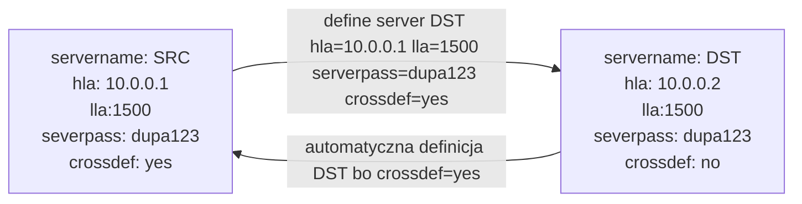

# Komunikacja z innymi serwerami

W romantycznych czasach bez szyfrowania, eestawianie komunikacji pomiędzy serwerami sprowadzało się do wydania trzech momend na dwóch serwerach. Teraz mniej więcej też, ale jak zwykle :material-emoticon-devil-outline: tkwi w szczegółach. Generalna idea jest pokazana na poniższym diagramie:




!!! Warning "Uwaga!"

    Po zestawianiu komunikacji lepirj nie zmieniać tych atrybutów. Zwłaszcza `serverpass`. 
    Dodatkowo, czasem zachodzi potrzba dołożenia dodatkowego serwera, albo [storage agenta](setup_sta.md). W takiej sytuacji lepiej znać `serverpass` niż zmieniać je na wszystkich serwerach.


    Jesłi zdecydujesz się na krótkie hasło np __nieużywane przeze mnie__ `dupa123`, ustaw `MINPWLEN` na `8`, bo definicja serwerów sie nie powiedzie.

    
    Jestem leniuchem i jeśli bezpieka mnie nie goni to używam jako `serverpass` wspólnego hasła dla wszystkich. To nie jest wielkie problem w dzisiejszych czasach, bo kominikacja i tak
    opiera się o certyfikaty, które trzeba ręcznie zimportować, albo podpisać przez CA.


Na powyższym diagramie jest pokazany mechanizm _crossdef_. Po włączeniu go, jeśli serwer definiuje inny serwer np SRC :material-arrow-right: DST, to DST automatycznie definiuje w drugą stronę: DST :material-arrow-right: SRC. Dzięki temu komunikacja będzie dwukierunkowa. W rzadkich przypadkach, kiedy SRC i DST sobie nie ufają trzeba się zastanowic, czy jest potrzebna, ale jak dotąd trafiłem tylko raz na sytuacje, gdzie nie mogłęm tego zrobić :wink:. 


Atrybuty serwera niezbędne do zestawianie komunikacji, przy kros-definicji:

- `serverhala` : Adress IP lub FQDN. Jeśli serwer ma wiele interfejsów, warto tu dać adres z VLANu dedykowanego pod replikację.
- `serverlla` : Port serwera. Zwykle 1500.
- `serverpass` : hasło serwera.

## Przygotowanie serwerów do komunikacji

Żródłem mądrości jest [ten](https://www.ibm.com/docs/en/storage-protect/8.2.1?topic=css-configuring-ssl-communications-between-hub-server-spoke-server) artykuł.

### Atrybuty do crossdef

Na obu serwerach wpisz odpowiednie dla nich wartośći:

=== "SRC"

    ```
    set serverhla 10.0.0.1
    set serverlla 1500
    set serverpass dupa123
    set crossdef yes
    ```

=== "DST"

    ```
    set serverhla 10.0.0.2
    set serverlla 1500
    set serverpass dupa123
    /* crossdef jest domyślnie "no" */
    ```

### Import certyfikatów

=== "SRC"

    Zwłożenie: 
        - Katalog instancji obu serwwrów to `/sp/inst1`

    1. Skopiuj do `/tmp` certyfikat DST:

        ```bash
        scp root@10.0.0.2:/sp/inst1/cert256.arm /tmp
        ```

    1. Zaimportuj certyfikat do bazy certów SRC. Jako właściciel instancji, np `spinst1`, stojąc w katalogu instancji, `/sp/inst1` :

        ```bash
        gsk8capicmd_64 -cert -add -db cert.kdb -stashed -format ascii -trust enable -label DST -file cert256.arm
        ```

        !!! Note 

            Według dokumentacji, prametr `-trust enabled` jest deprecated, ale żeby było zabawniej pojawił się dopiero w dokumentacji do 8.2 :grinning:.
    
    1. Zrestartuj instancję.
    

=== "DST"

    Zwłożenie: 
        - Katalog instancji obu serwwrów to `/sp/inst1`

    1. Skopiuj do `/tmp` certyfikat DST:

        ```bash
        scp root@10.0.0.1:/sp/inst1/cert256.arm /tmp
        ```

    1. Zaimportuj certyfikat do bazy certów SRC. Jako właściciel instancji, np `spinst1`, stojąc w katalogu instancji, `/sp/inst1` :

        ```bash
        gsk8capicmd_64 -cert -add -db cert.kdb -stashed -format ascii -trust enable -label SRC -file cert256.arm
        ```

        !!! Note 

            Według dokumentacji, prametr `-trust enabled` jest deprecated, ale żeby było zabawniej pojawił się dopiero w dokumentacji do 8.2 :grinning:.
    
    1. Zrestartuj instancję.

## Definicja komunikacji

Na serwerze źródłowym (SRC) zdefiniuj serwer DST:

```
define server DST hla=10.0.0.2 lla=1500 serverpass=dupa123 crossdef=yes
```

## Test

1. Sprawdź czy na sewerze DST pojawiłła się definicja serwera SRC:

    ```
    q server
    ```


    !!! Example "Przykład"

        ```
        Protect: DST>q server 

        Server       Comm.      High-level        Low-leve-      Days      Server         Virtual        Allow      
        Name         Method     Address           l Address     Since      Password       Volume         Replacement
                                                                Last      Set            Password       
                                                                Access                    Set            
        --------     ------     -------------     ---------     ------     ----------     ----------     -----------
        SRC          TCPIP      10.0.0.1          1500              <1     Yes            Yes            No 
        ```
    
2. Pingnij serwery na wzajem:

    ```
    ping server XXX
    ```

    === "SRC"

        ```
        Protect: SRC>ping server DST
        ANR4617I A ping request to server 'DST' was able to establish a connection by using server credentials.
        ANR1706I A ping request to server 'DST' was able to establish a connection by using administrator credentials.
        ```
    
    === "DST"

        ```
        Protect: DST>ping server SRC
        ANR4617I A ping request to server 'SRC' was able to establish a connection by using server credentials.
        ANR1706I A ping request to server 'SRC' was able to establish a connection by using administrator credentials.
        ```

    !!! Note "Ważne"

        Żeby `ping server` się udał, administrator "pingującego" serwera musi być zdefiniowany na "pingowanym" i mieć __takie samo hasło__.

## Co dalej?

Komunikacja _server to server_ przydaje się do:

- [Replikacji](../adm/repl.md).
- Relacji HUB - Spoke
- Exportu importu
- Enterprise adminsitration

!!! Bug 

    Napisać o brakujących tematach. 