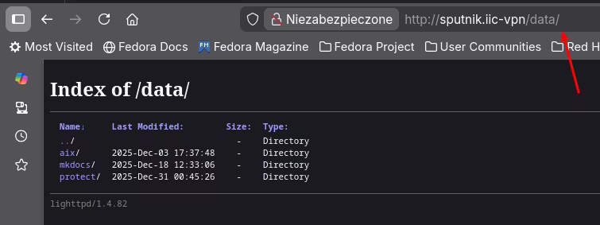

# Po(d)ręczny webserwer

Czasami potrzebny jest webserwer, taki nie za skomplikowany, ale jednak na stałe. Np żeby postawić serwer pod dokumentację `mkdocs` albo pod repozytorium yum/dnf. Albo jako wewnętrzny serwer plików. W projektach często przydaje się taka mała zabaweczka, choć jak ją bezpieka wyniucha, to zwykle jest afera :wink:.

??? Tip "Webserwer na chwilę"
    Webserwer na chwilę to najprościej odpala się tak:

    1. Wejdź do katalogu, który chcesz udostępnić.
    1. Odpal takiego :simple-python:

        ``` sh title="Prosty łebserwer w pythonie"
        python3 -m http.server 8000
        ```

        Można też na standardwoym porcie, ale jako `root`:

        ``` sh title="Prosty łebserwer na porcie 80"
        sudo python3 -m http.server 80
        ```


Szukając czegoś prostego, znalazałem *Lighttpd* - mały, szybki, dość prosty w konfiguracji (dużo dropinów, co jest przyjazne :simple-ansible:utomatyzacji).

## Instalacja

Lighttpd jest dostępny w systemowych repozytoriach :simple-redhat: od 8 w górę. No i w moich ukochanych :simple-fedora:. Fani :simple-ubuntu: czy innych pochodnych :simple-debian: też będą zadowoleni. Dlatego instalacja jest prosta. Na Fedorze wystarczy nappisać:

``` sh title="Instalacja lighttpd"
dnf install lighttpd
```

Szarpnie sobie kawałek internetu w zależnościach i gotowe.

## Podstawowa konfiguracja

Po wyjęciu z pudełka, Lighttpd będzie serwował po http (bez "s") zawartość katalogu `/var/www/lighttpd`. Jeśli to wystarczy, to gotowe :shrug:

!!! Note inline end "SELiux"
    Wychodzę z zalożenia, że jak coś nie działa z SELinuxem, to znaczy, że jest zepsute. 

Ja mam nieco większe wymagania:

- ma mieć możliwość przeglądania (*directory browsing*) katalogu `/data`, który jest u mnie dedykowanym filesystemem
- ma działać z SELinuxem 

### Kontekst SELinux

Trzeba nauczyć Linuxa, że każdy plik, który jest w katalogu `/data` i podkatalogach, ma być dotykalny dla Lighttpd:

```sh title="Ustawianie domyślnego kontekstu dla /data"
sudo semanage fcontext -a -t httpd_sys_content_t "/data(/.*)?"
```

!!! Warning "Ważne"
    Jeżeli w docelowym katalogu są już jakieś pliki to pewnie mają złe etykiety. Dlatego trzeba je poprawić komendą:

    ```sh title="Naprawa etykiet w /data"
    sudo restorecon -vR /data
    ```

### Alias `/data/`

Podobnie jak w Apache :simple-apache:, Lighttpd potrafi wystawić dowolny katalog z filesystemu jako alias. U mnie systemowy katalog `/data` będzie wystawiony jako `http://adres.mojego.serwera/data/` i będzie zezwalać na przeglądanie katalogów, ponieważ zamierzam tam trzymać repozytorium dla klienta IBM Storage Protect i kilka innych instalek. 

Żeby nie ruszać głównego pliku konfiguracyjnego tworzę drop-in: `/etc/lighttpd/conf.d/data.conf` z następującą zawartośćią:

``` title="/etc/lighttpd/conf.d/data.conf"
server.modules += ( "mod_alias", "mod_dirlisting" )

# zmapuj URL /data na katalog /data w systemie plików
alias.url += ( "/data/" => "/data/" )

# włącz listing katalogów tylko dla /data
$HTTP["url"] =~ "^/data($|/)" {
    dir-listing.activate = "enable"
    dir-listing.encoding = "utf-8"
}
```

!!! Warning "Ważne"
    Jesłi podasz URL bez "/" na końcu, serwer będzie próbował znaleźć w docelowym katalogu plik `index.html`. Jeśli go nie znajdzie, zwróci błąd 404. 

Po restarcie serwera (zwyczajowe `systemctl restart lighttpd`) I otwarciu w przeglądarce `http://mój.server/data/` powinna pojawić się zawartość katalogu: 

