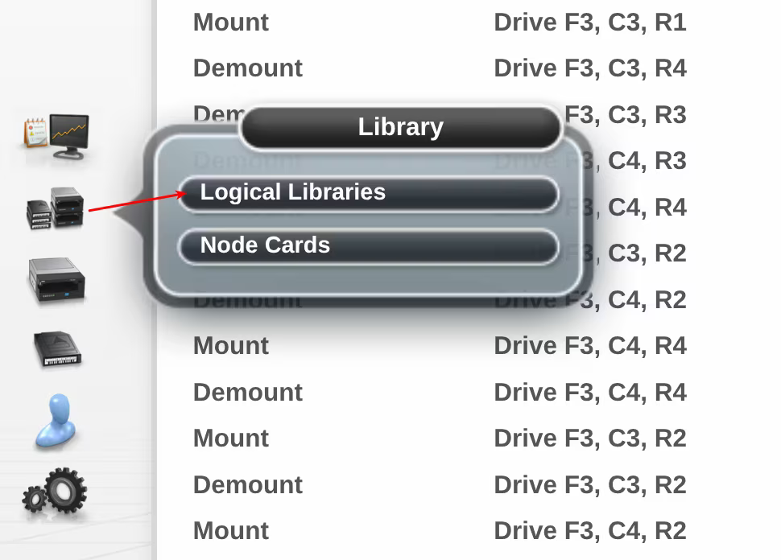
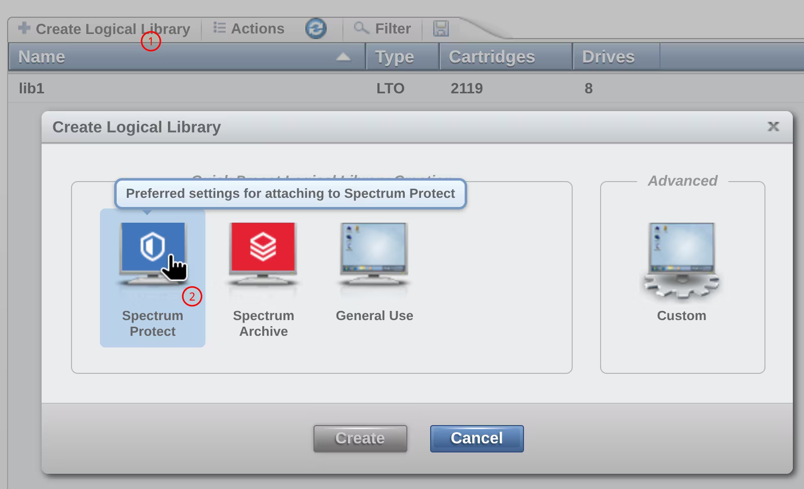
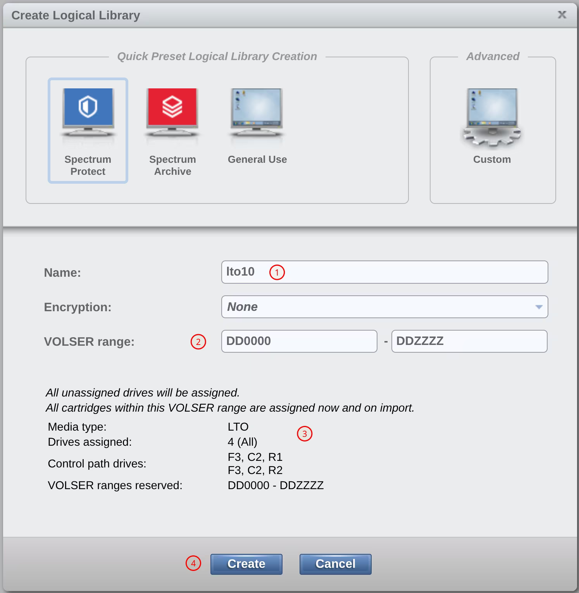
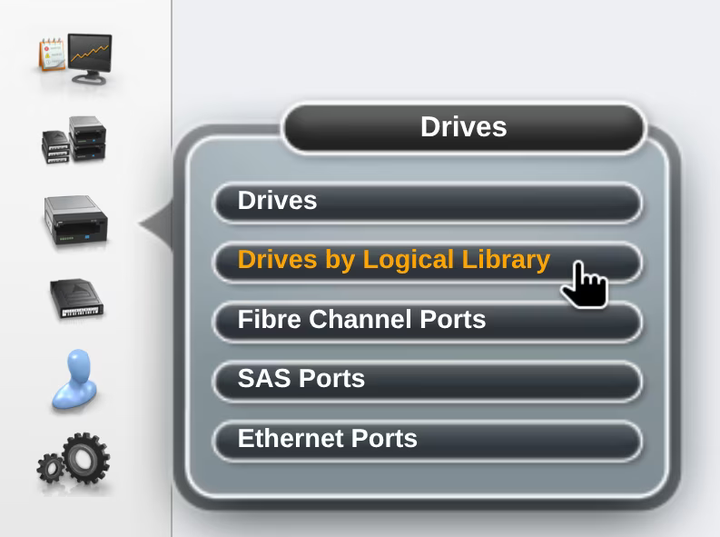
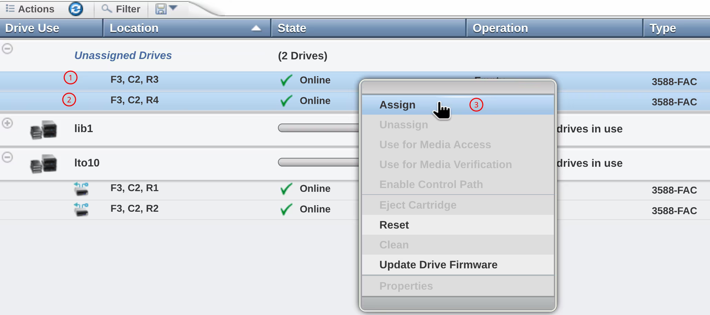
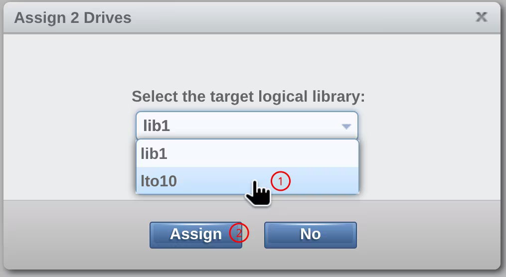
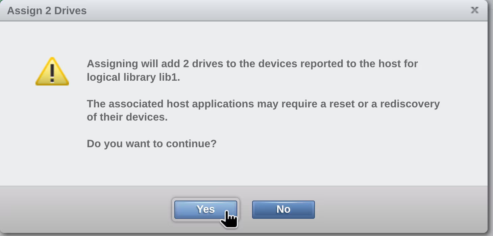

# Biblioteka logiczna (partycja)

TS4500 wymaga stworzenia przynajmniej jednej biblioteki logicznej. Niestety magiczna kompatybilność w dół przeszła już do historii, więc lepiej po prostu przyjąc zasadę tworzenie dedykowanych bibliotek logicznych dla poszczegónych typów taśm/napędów i tyle :man_shrugging:.

## Tworzenie partycji

1. Zaloguj się na gui biblioteki i przejdź do menu bibliotek logicznych:

	 
	
	 

1. Wybierz _Create Logical Library_ (1), a potem jedyną słuszną opcję _Spectrum Protect_ (2) :wink: :
	
	 
	
	 

1. Opisz bibliotekę. U mnie będzie się nazywała `lto10` (1) i będzie miała zakres taśm (volser) od `DD0000` do `DDZZZZ` (2). Klinąłem _Details_ dlatego widać sekcję (3). Jak widać, automatycznie wziął dwa napędy do ścieżki kontrolnej. To trochę kwadratowe, bo chciałem 4 napędy, ale to można potem zmienić. Kliknij _Create_ (4), żeby utworzyć bibliotekę.
	
	 
	
	 

1. Przejdź do menu _Drives by Logical Library_ żeby dodać ewentalne brakujące napędy do biblioteki `lto10`:
	
	 
	
	 

1. Zaznacz nieprzypisane napędy (1 i 2), kliknij na nie prawym klawiszem myszy i wybierz opcję _Assign_ (3):
	
	 
	
	 

1. Wybierz docelową bibliotekę `lto10` (1) i kliknij _Assign_ (2):
	
	 
	
	 

1. Na wyświetloną szykanę odpowiedz _Yes_:
	
	 
	
	 

!!! Note "Zwróć uwagę"

	Jeśli bibliotek `lto10` została dodan do Storage Protect przed dodaniem do niej dodatkowych napędów, konieczne będzie:

	1. Audyt biblioteki, np `audit library lto10 checklabel=barcode refresh=yes`
	1. Zdefiniowanie napędów.
	1. Zdefiniowanie ścieżek do tychże napędów.