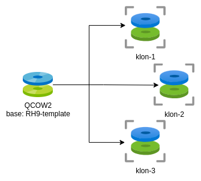
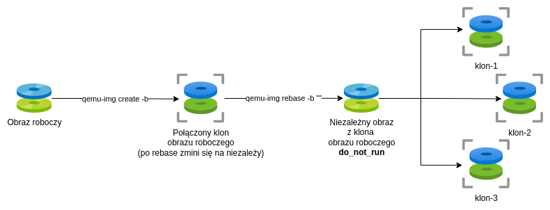

# Przydatne komendy związane z `qemu-img`.

Rożne często używane przeze mnie funkcje `qemu-img`.

## Tworzenie obrazu w formacie `qcow2`

```
$ qemu-img create RHEL9-srv-07.2025.qcow2 -f qcow2 70G
```

**Uwaga:** To tworzy plik typu *sparse* co może generować pewne problemy np przy kopiowaniu, czy z niektórymi backupami. 


## Tworzenie zlinkowanego klona obrazu dysku

Do tworzenia prostych klonów w architekturze podstawka -> wiele klonów. 



**Uwaga:** Uruchomienie VMki korzystającej z podstawki rozpieprza klony! Dlatego dobrze jest ją np nazwać jakoś w stylu: `RH9-template-<data>-do_not_run.qcow2` albo cooś takiego. 

W przykładzie poniżej z dysku roboczej maszyny `RHEL9-srv-07.2025.qcow2` tworzę "mastera", który będzie potem oderwany od oryginału, żeby być niezmienialną podstawką do klonów.

```
$ qemu-img create RHEL9-template-07.2025-don_not_run.qcow2 -f qcow2 -b RHEL9-srv-07.2025.qcow2 -F qcow2 
Formatting 'RHEL9-template-07.2025-don_not_run.qcow2', fmt=qcow2 cluster_size=65536 extended_l2=off compression_type=zlib size=75161927680 backing_file=RHEL9-srv-07.2025.qcow2 backing_fmt=qcow2 lazy_refcounts=off refcount_bits=16
```

## Konwersja zlinkowanego klona do niezależnej kopii

Ponieważ chcę używać roboczej wersji maszyny, której ma istnieć także kilka klonów, chcę doprowadzić do sytuacji nak na obrazku:



Oderwanie klona od oryginału robi się komendą `qemu-img rebase` podając pusty string jako nowa podstawka: `-b ""`:

```
$ qemu-img rebase -p -b "" RHEL9-template-07.2025-don_not_run.qcow2
    (100.00/100%)
```

Prełącznik `-p` jest od pokazywania postępów.
